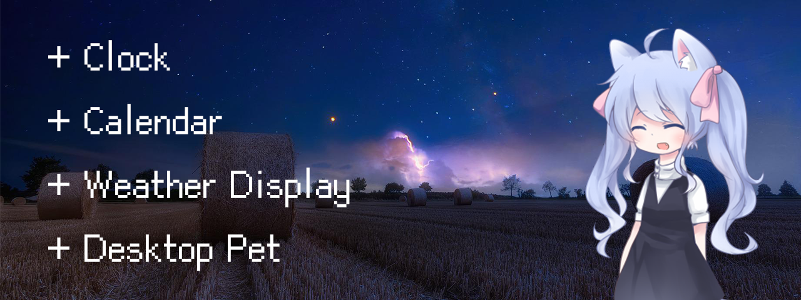
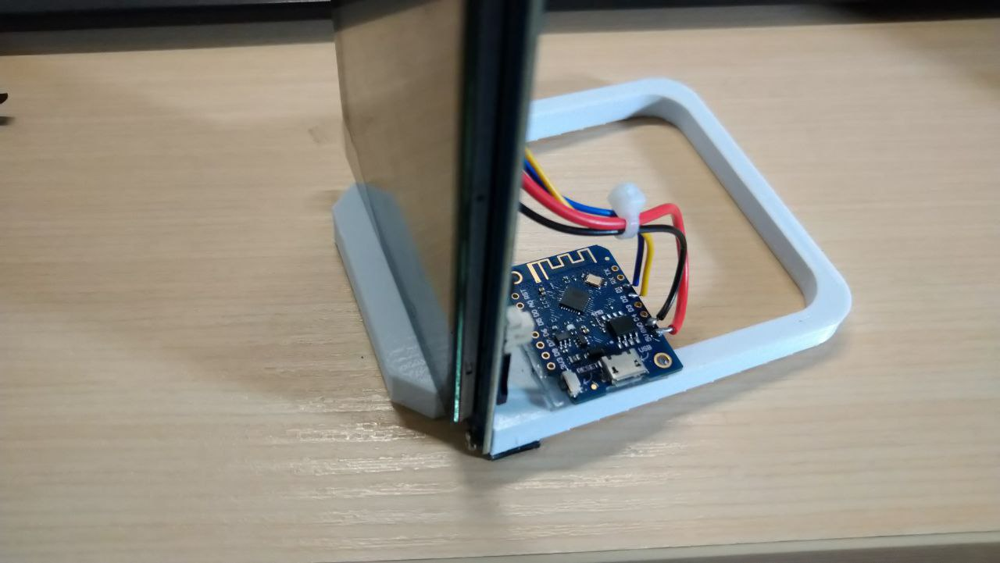
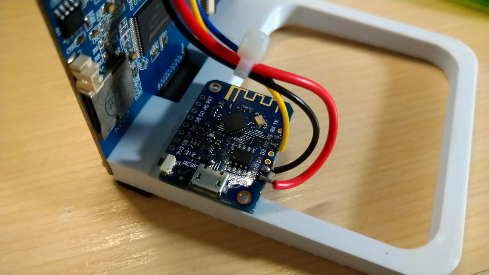
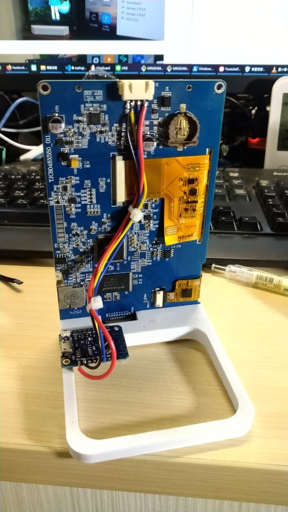
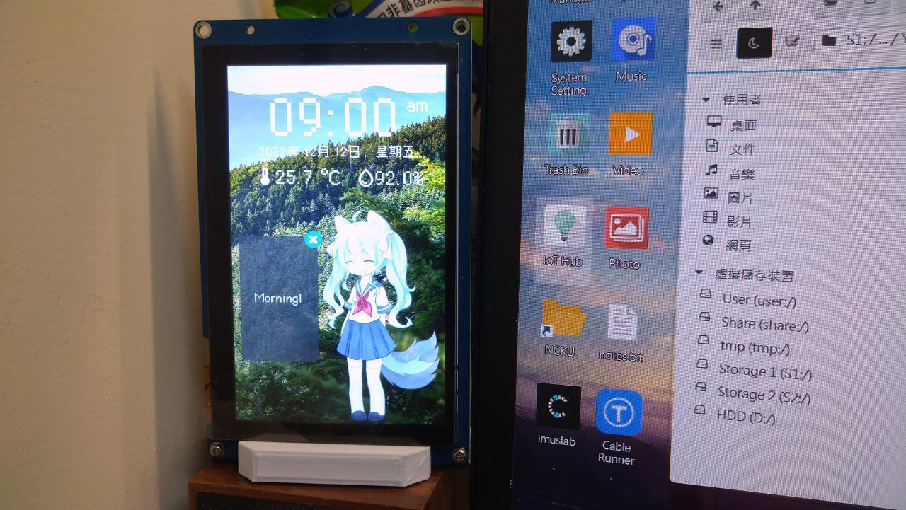
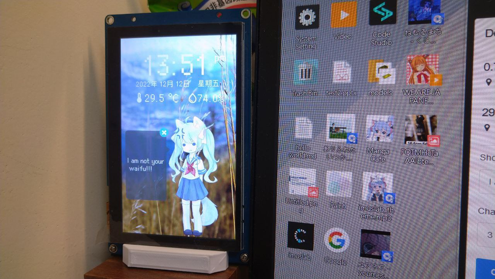
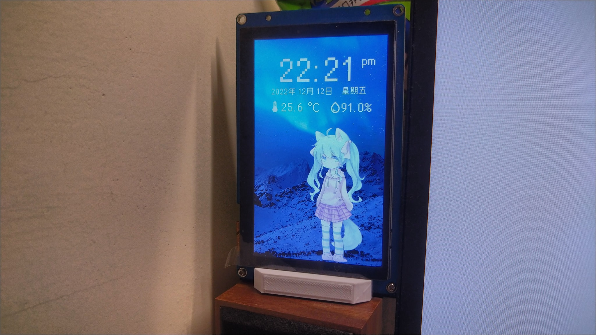
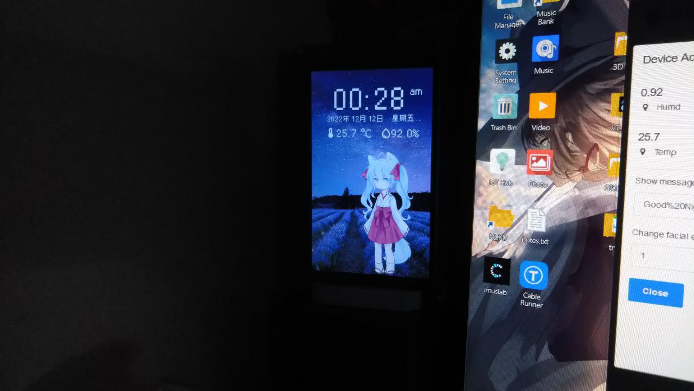

# Weather + Desktop Pet Display

A simple weather display with a cute interactive desktop pet  (❛◡❛✿)

## Introduction

Weather display is like one of the most done Maker project out there, involving simple parts and quite useful when put on your working desk. As a maker who is always trying to make beautiful yet technical projects, I decided to give it a try and challenge one of the most done project!

**Notes: This application provided only Tainan Weather by default (as this is where I currently live). If you need other location, please modify the code accordingly.**

## Build Instruction

### Material List

- ESP8266 (Wemos D1 Mini)
- UART HMI Display (The one used here is 5 inch touch screen model, TJC8048X550_011)
- Wires
- M3 x 10 screws x 2
- 3D printed base

### Building Instruction

1. Flash the program into the ESP8266 (See src/esp8266 folder)
2. Flash the program into the display using USART HMI Studio

3. Solder the following wires to the display 4 pin serial input

| Wemos D1 mini | UART HMI | Wire Color |
| ------------- | -------- | ---------- |
| 5V            | 5V       | RED        |
| GND           | GND      | BLACK      |
| D1            | RX       | BLUE       |
| D2            | TX       | YELLOW     |

|  |  |
| -------------- | -------------- |

4. Power it on, then it is done!

## Photos

Morning mode (Full brightness and in school uniform)

Afternoon mode (Notice you can send in message and change facial expression via HTTP request)

Night mode, a bit more relaxing background and reduced brightness

Mid-night mode, set to lowest backlit LED brightness

## License

MIT

